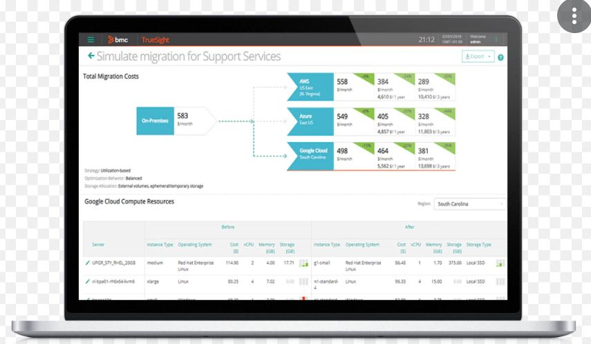

# Certifications
---
1. Oracle Certified Professional, Java SE 6 Programmer (OCJP) – Feb 2013
2. Oracle Certified Professional, Java EE 5 Web Component Developer (OCWCD) - Aug 2013
3. Oracle Database 11g: SQL Fundamentals I - Nov 2014
4. AWS Certified Solution Architect – Aug 2019
5. Certified Kubernetes Application Developer – Sept 2021

 

# Data Science Portfolio
---
## Machine learning

### Fraud Detection

Fraud detection is a set of processes and analyses that allow businesses to identify and prevent unauthorized financial activity. This can include fraudulent credit card transactions, identify theft, cyber hacking, insurance scams, and more.

 

# Java Portfolio
---
## BMC Software
---
Working in BMC Software from Feb 2015 - till date.
 
Languages: Java (Spring, MicroServices, gRPC), Perl, Python
 
Databases: Oracle, Postgres, Victoria metrics etc
 
Softwares: Docker, Kubernetes, EFK stack, Elasticsearch, Prometheus, Kafka, Redis, Kibana, Ansible etc
 
Integrations with Cloud: AWS, Azure, GCP, PCF, IBM etc
 
Integrations with Onprem-Cloud: VMWare, vCloud, Openstack, Nutanix, OEM, RHEV etc

### Product - Business Workflow
BMC Helix Business Workflows is a modern case management solution built for Service Delivery Owners, including HR, Facilities, and other groups—in a scalable, managed, and automated way.

 

### Product - Capacity Optimization
TrueSight Capacity Optimization aligns IT resources with business service demands, optimizing resource usage and reducing costs. It help to Plan, manage, and optimize on premises and cloud resources.
#### Features
* Visualize IT resources for a business service
* Predict IT resource needs due to changes in business service demand
* Optimize the use of cloud and on-premises IT resources
* Simulate migrating workloads to the cloud
* Reserve and schedule IT infrastructure resources for releasing new applications

 

## TCS 
---
Worked in TCS from Sep 2010 to Feb 2015
Worked of Java, Struts, MySQL projects

### Worked on projects

* Timesheet for Barclays
* Pingit, BMB for Barclays
* HPDiscover For HP
* POC for low end mobile phones for IDBI Federal Life Insurance Company
* Worked on POC’s like NFC banking, TCS Secure transport system, mServices, iMedizen etc
